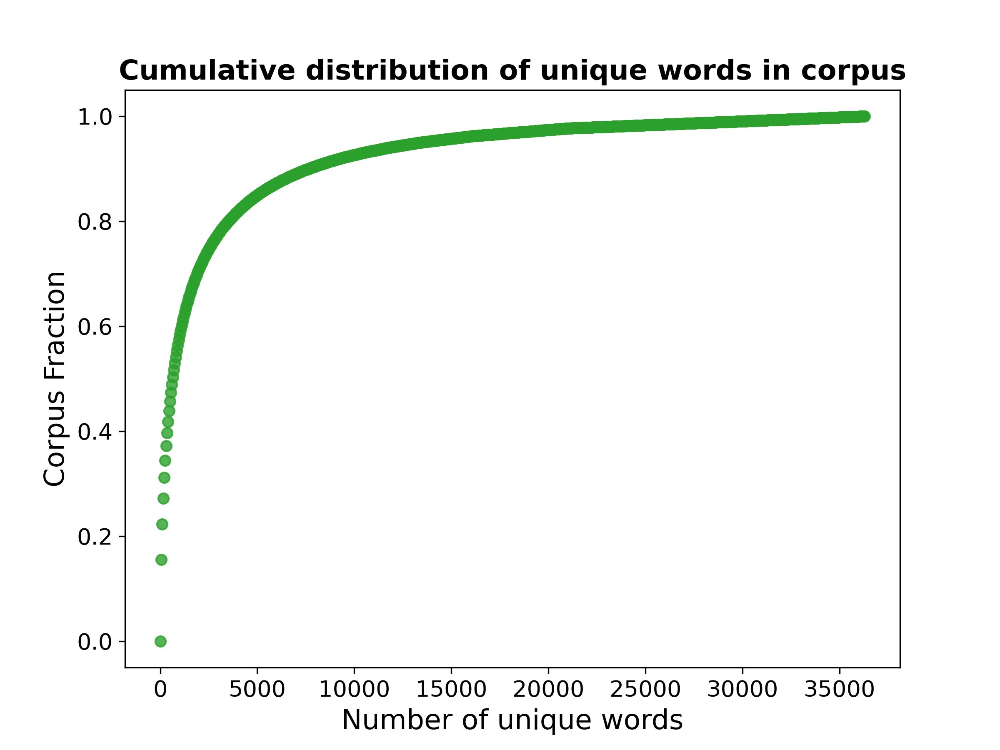
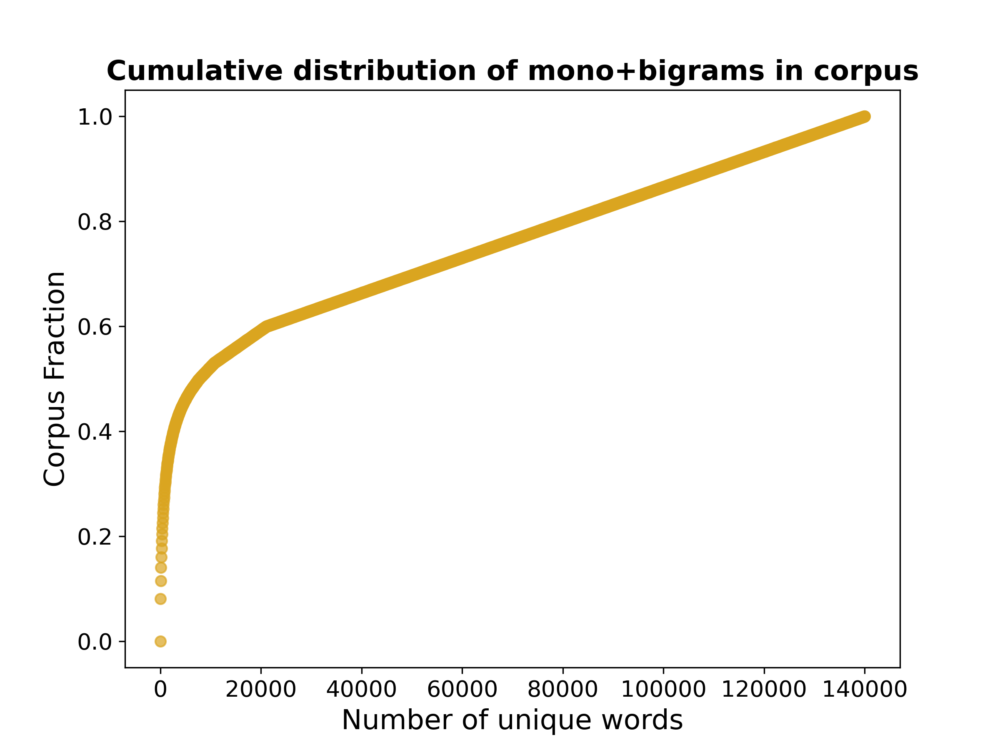
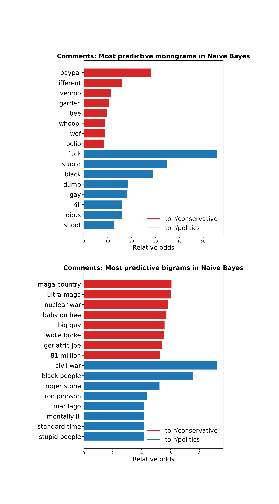

# Project 3 - Web APIs and Natural Language Processing with Reddit

by Martijn de Vries  
martijndevries91@gmail.com

## Problem Statement

A US political consultancy company is researching how news sources and discussed topics differ between the US political mainstream and the conservative right-wing media. In the last decade or so, the US political right-wing has been increasingly described as living in an entirely separate information ecosystem from the political mainstream. In order to gauge how intense this effect is, we will collect, process, and classify the Reddit content of two politically-themed subreddit that reflect the mainstream and conservative voters respectively: <b>r/politics</b> and <b>r/conservative</b>. 

For this project, we will build two separate branches of models: one for post submissions (largely consisting of links to news sites), and another for comments (consisting of actual Reddit users discussing political news). As this is a binary classification problem where the two classes are of equal interest and will be approximately balanced, we will use the accuracy score as the main metric to gauge the success of the classification model. 

Because political news is always evolving, we have chosen a specific moment in time: the month leading up to the 2022 midterms, October 6th to November 6th 2022. This ensures that 1) the same news cycle is covered for both subreddits, 2) both subreddits were at peak activity, and 3) maximum potential for interesting insights in the way that news is discussed within these two subreddits.

## Repository Overview
    
This repository consists of the following:

<ul>
   <li> The directory <code>./code</code> contains five notebooks that go through each of the steps of the analysis: 
   
   <ol>
    <li> In <b>data_collection.ipynb</b>, I use the Pushshift API to collect the data from reddit, which are then saved to dataframes </li>
    <li> In <b>EDA_and_cleaning.ipynb</b>, I do some cleaning of the dataframes, like deleting duplicates and non-english posts. I also do some EDA related to word frequencies and figure out which features to use in the model </li> 
    <li> In <b>sentiment_analysis.ipynb</b>, I use the roBERTa-based sentiment analysis to obtain sentiment labels and scores for each of the comments in the cleaned dataframe </li>
    <li> In <b>NLP_and_modeling.ipynb</b>, I set up an sklearn pipeline for natural language processing, and try out several different models, and save the best-performing model objects with pickle </li>
    <li> In <b>model_insights_conclusions.ipynb</b>, I do interpretation regarding the most significant features, and give my overall conclusions to the project </li>
    <li><b>custom_funcs.py</b> contains one function and a custom sklearn transformer class that I wrote during the project, so that I could reuse them across different notebooks. </li>
   </ol>
  <li> The directory <code>./data</code> contains dataframes with the collected data from reddit for both post titles and comments, as well as cleaned versions of these dataframes. Additionally, for the comments data there is an extra .csv file which appends the sentiment analysis features to the cleaned comments dataframe.
    <li> The directory <code>./pickled_models/</code> is to save the pickled model objects that are saved in the NLP and modeling notebook. These were not uploaded to the remote repository for storage space reasons, so they will have to be recreated in the notebook.
   <li> The directory <code>./figures</code> contains all the figures that are saved during the analysis in the notebooks, in .png formats </li>
    <li> The slides for the project presentation are in the file <code>project3_martijn_slides.pdf</code> </li>
</ul>

## Subreddits Overview:

<a href=https://www.reddit.com/r/politics/>r/politics</a> is Reddit's biggest politically-themed subreddit, with 8.3 million subscribers as of May 2023. It is focused on the discussion of US political news. The vast majority of posts on r/politics are links to news articles, with the post title being the article headline. The article is typically discussed by reddit users in the comments. Although the subreddit is not officially pro-Democratic or pro-Republican party, because it is the mainstream subreddit and because the general userbase of Reddit skews younger and more Democratic/left-wing, it has a fairly strong bent to the Democratic/left-wing side of the political aisle.

<a href=https://www.reddit.com/r/conservative/>r/conservative</a> is Reddit's biggest conservative-specific political subreddit, with 1 million subscribers as of May 2023. It focuses on discussing US politics news specifically from a conservative perspective. Just like on r/politics, most posts are links to news articles, which are then discussed by users in the comments. This subreddit is more restrictive in who is allowed to post or comment. Some of the posts are for 'flaired users only', which indicates that only regular commentors on the subreddit are allowed to comment.

## Data Dictionaries
The data dictionaries for the best-performing models for posts and titles are listed below

### Posts model

|Feature|Type|Dataset|Description|
|---|---|---|---|
|title | string | Reddit data | The title of the subreddit post. Typically the headline of a news article
|num_comments| int | Reddit data| the number of comments below each post 
|domain| category | Extracted from Reddit data| the domain name the post links to, eg. typically news sites like 'politico' or 'nytimes'
|subreddit| category | Reddit data  | ***Target variable***- Encoded as 0: r/conservative and 1: r/politics |

### Comments model

|Feature|Type|Dataset|Description|
|---|---|---|---|
|title | string | Reddit data | The comment text | 
|score | int | Reddit data | The comment score |
|word_length | int | extracted from Reddit data | The comment word length |
|freq_poster | category |  extracted from Reddit data | Whether the poster has made more than 15 posts in 30 days |
|sent_label | category | extracted from Reddit data  | Sentiment label of comment, using roBERTa sentiment analysis |
|subreddit| category | Reddit data  | ***Target variable***-  Encoded as 0: r/conservative and 1: r/politics  |

## Data Collection

I used the Pushshift API, together with the Python library 'requests' to collect data, collecting data on posts and comments individually. In total, I collected 20421 posts and 61911 comments over a time range of 31 days (October 6th to November 5th, 2022). The raw data for both posts and comments are saved as pandas dataframes in the <code>./data</code> folder.

## Cleaning and EDA

After filtering out duplicates, non-english posts, posts by bots or moderators etc, I did some basic EDA to figure out which features might be useful in the model.

In the posts data we obtained, more than 99% do not contain any useful information in the body (called the 'selftext'). Because of this, I did not look at the selftexts and only focused on the title and some additional information for this model. I also included the number of comments below each posts as a feature.

A final piece of important information is the link that is included with the post. I extracted the domain name from this link (like Bloomberg, New york times, youtube, etc) and included this as a feature in the model. As it turns out, this feature adds a lot of predictive power because of the high level polarization in political media. As a fairly obvious example, articles from ultra-conservative site Breitbart are almost never posted on r/politics. 

For the comments model, after some investigation I decided to use the score (number of upvotes vs downvotes), the word length of each comment, and whether the post was made by a frequent poster or not (more likely in r/conservative, where there are restrictions on who is allowed to post). I also added a 'sentiment label' (neutral/negative/positive, using the roBERTa language model sentiment analyzer). 

Because there is a large variety of different words used in comments, the number of features will get very large after vectorizing. For that reason, I looked at word frequency across the corpus of all comments. The plots below show the number of unique monograms (left), or monograms + bigrams  (right) and what is the fraction of the corpus they make up cumulatively:

  
  

When just using monograms (single words), we can see that we could limit the maximum number of features by about 1/3rd, and only lose about 1% of all words in the corpus. Setting such a constraint helps combat overfitting, at relatively little loss. To retain some context of the words however, I also wanted to include bigrams (sets of two words). As can be seen in the plots above, this greatly blows up the number of features, and it also becomes more difficult to find a natural cutoff point to limit the number of features. This inspired me to write a custom sklearn transformer (Tfidf_BigramReducer) where we can tune how many bigrams we want to keep, while still keeping most of the monograms.

After cleaning, we're left with about 19,000 posts, with a 53/47 split between r/conservative and r/politics. For comments, we were left with about 48,000 comments with a 47/53 split between r/conservative and r/politics.

## Best Models

### Posts

Out of the models I tried, the best-performing classification model is a Stacking Classifier, with a Logistic Regression, Random Forest, and Multinomial Naive Bayes as base estimators and a Logistic Regression as the final estimator. The sklearn diagram below shows the full data pipeline: the comment text is vectorized with my custom transformer that wraps around TfidfVectorizer, the numerical features are scaled, and the categorical feature (the domain name) is one-hot encoded.

 
 
The accuracy is <b>99.0%</b> on the training data, and <b>88.1%</b> on the testing data.

### Comments

Just like with posts, the best-performing model is a stacking classifier, composed of the same estimators. The overall pipeline is very similar - the comment text is vectorized, the numerical features scaled, and the categorical feature (in this case the sentiment) is One-hot encoded.

The accuracy is <b>85.2%</b> on the training data, and <b>65.4%</b> on the testing data.

## Model Insights

The base estimators within the stacking classifier all have some degree of interpretability when it comes to the features inside the model. For the posts model, the 'domain' feature (which website is the article from), ended up being one of the most important one, and one of the main reasons of why the posts model performs with relatively high accuracy.

I also looked at which monograms and bigrams are the most predictive in convincing the classifier that the post/comment comes from one or the other subreddit. An example for the Naive Bayes classifier from the comments model is shown below:

 

Because of the relatively poor performance of the comments model, we also spent some time evaluating what the main reason is that comments get misclassified. One important reason seems to be word length, as illustrated in the plot below:

 

If we calculate the accuracy for only comments above a certain length, the accuracy goes up - and vice versa for calculating the accuracy below a certain word length.  In other words, the longer the post the higher the probability that there is a feature in there that the model thinks significantly moves the needle towards one subreddit or the other.

## Overall Conclusions
Using Pushshift API, I collected data from two different subreddits, r/politics and r/conservative, from the month leading up to the 2022 midterms (October 2022). I tested out different classification models in order to classify 1) posts and 2) comments. After data cleaning, I was left with about 19,000 posts (53/47 split for r/conservative - r/politics, respectively), and 48,000 comments (47/53 split). In order to model the language, I used a 'bag of words' approach with a TF-IDF (Term Frequency - Inverse Document Frequency) vectorizer.

For the posts model, other than the title I included two additional pieces of information: the number of comments on each post, and the domain name that the post linked to. The final model that I used consists of a Stacking Classifier, using Logistic Regression, Random Forest, and Multinomial Naive Bayes as the base estimators. and a Logistic Regression as the final estimator. The final accuracy on the testing data is <b>88.1%</b>. Analysis of the feature importances indicates that the domain names are highly predictive and help improve the accuracy score a lot. This makes a lot of sense given the fact that the US political media system is highly polarized, and certain websites are only read by conservatives while others are highly avoided by conservatives, and vice versa.

For the comments model, I included several other pieces of information: the score of the comment, the word length, whether the commenter is a frequent poster or not, and the sentiment of the comment (Negative/neutral/positive, using sentiment analysis with the roBERTa model). The best-performing model was again a Stacking classifier with the same estimator components as for the posts model. The final accuracy on the testing data is <b>65.4%</b>. Unlike with the posts model, it appears that none of the additional non-language features I added improve the accuracy by very much. One of the main reason for misclassification appears to be the fact that many comments are just too short for the model to be able to classify them with much certainty.

The base models that make up the Stacking Classifier allow us to look into which features add predictive power to the model, which means we can look at the language that is used and the degree to which this determines whether the post or comment comes from either subreddit. Although a full analysis of language use is beyond the scope of this project, using the visualizations in the model insights notebook we can point to some directions that might warrant further exploration or analysis: 

1) <b>Abortion</b>: discussions about this topic have greatly flared up since the Dobbs v Jackson decision by the Supreme Court in June 2022. We can see this discussion show up in different ways in the two subreddits: the phrase 'pro life' appears to be highly predictive of r/conservative, which makes sense as this moniker is often used by anti-abortionists to describe themselves. On the r/politics side, the terms 'Supreme Court' and 'abortion' show up as important features

2) <b>Presidents</b>: it appears that 'Biden' is much more mentioned on the conservative side (see also 'geriatric joe') while Trump (and related terms like 'mar lago') is more often mentioned on r/politics 

3) <b>The pandemic</b>: it appears that on r/politics, COVID and the pandemic may not have been as important in the discourse as on r/conservative. On r/conservative, we can see terms like 'covid' and 'vaccine' as important features, but equivalents are not directly obvious on r/politics

4) <b>The other side of the political aisle</b>: both side use certain terms to describe the other side. On r/conservative, we see highly predictive features such as 'left', 'leftists', while r/politics uses terms like 'right wing' and 'far right'.

Ultimately, we were quite a bit more succesful in classifying posts compared to comments. This is largely due to the domain feature that is included with the posts model. In this particular case, more comments data might help combat overfitting and avoid the model erroneously adding significance to certain words. Performance may be slightly improved by  more hyperparameter tuning of the stacking classifier as well.